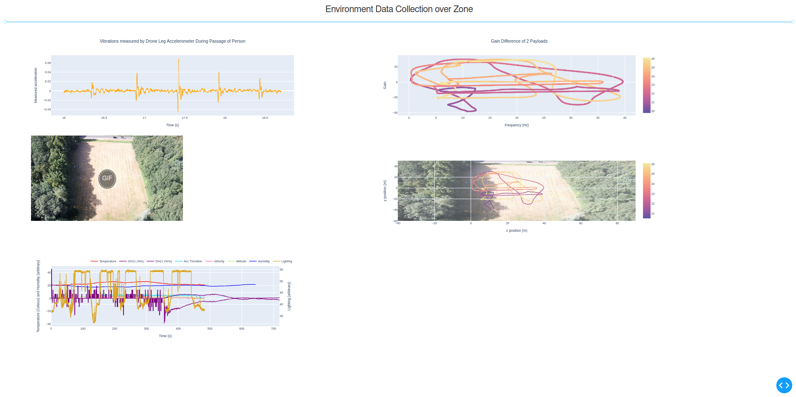
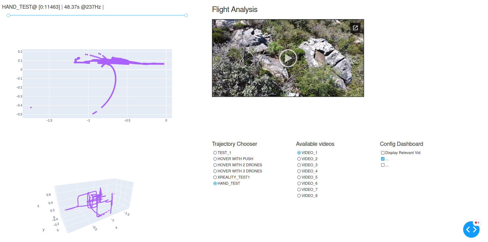
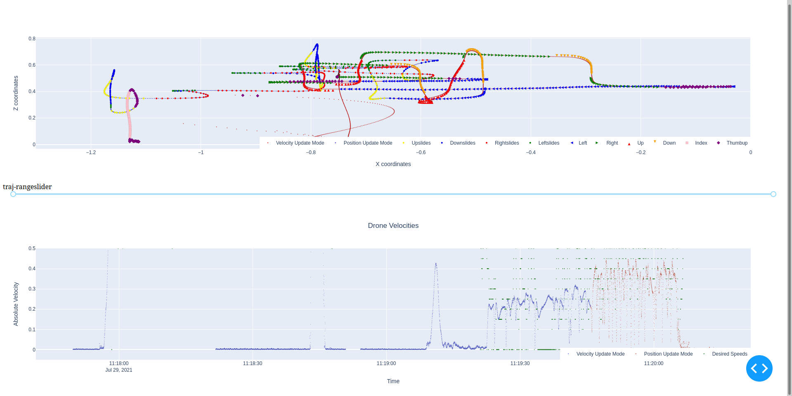
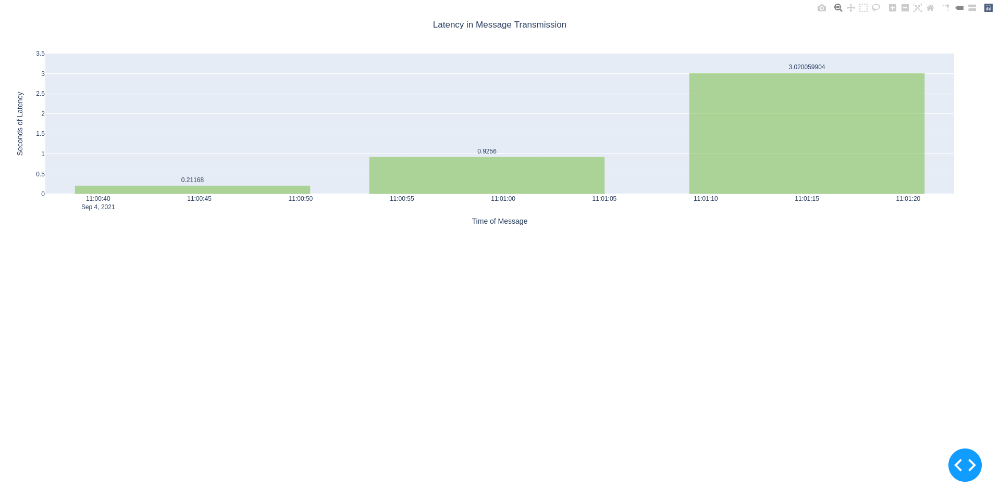
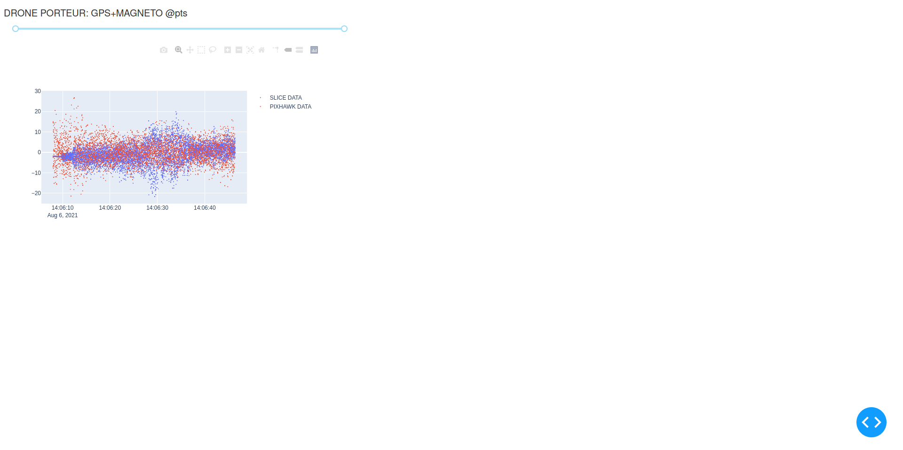
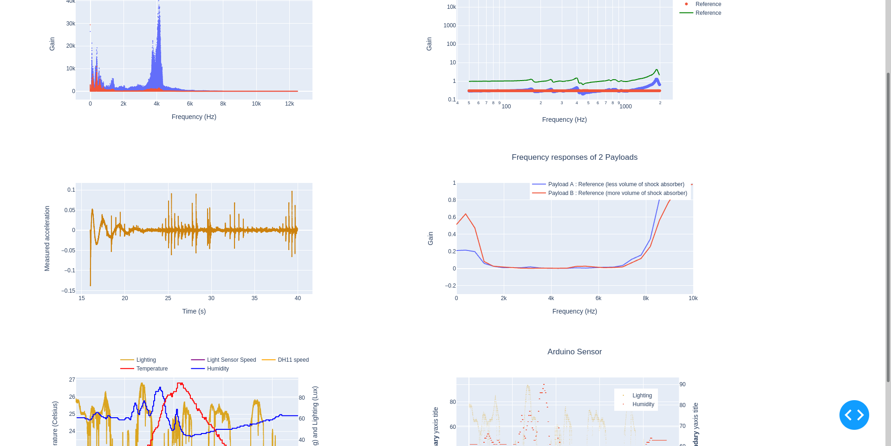
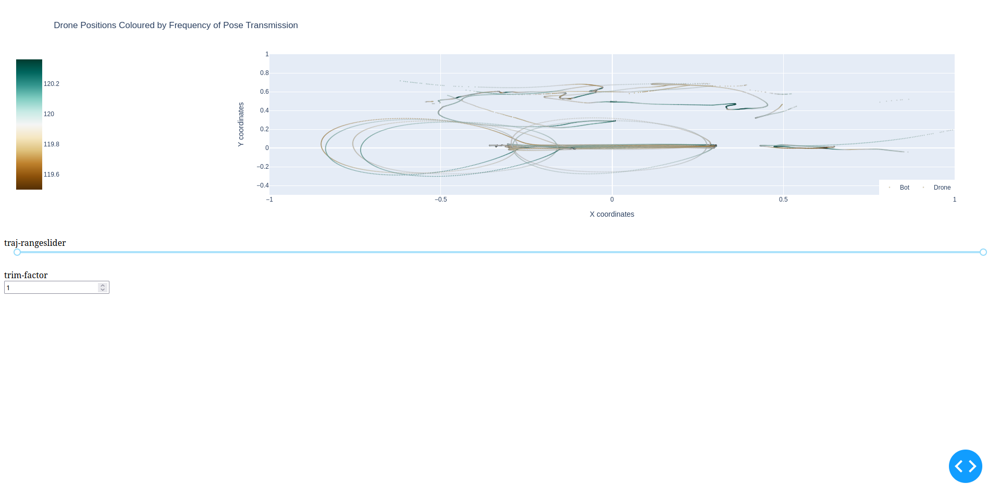
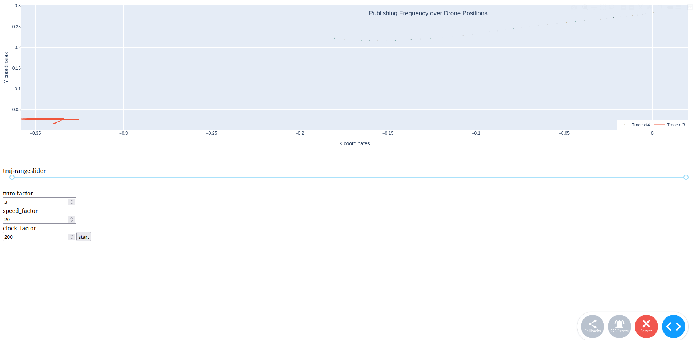

# dash_tutorials
Experimentation with the python Dash library: v3.0 snapshots of work processes.

clearing_data_exploration             |  AT_realtime_bar
:-------------------------:|:-------------------------:
  |   
First few tests onboarding the Pixhawk on a random drone. | Final field tests with the home-built drone.

Custom dashboards, including one for the Flight Arena:

WEB_arcade_dashboard_1(1)            |  WEB_arcade_dashboard_1(2)
:-------------------------:|:-------------------------:
.png)  |  .png)
Measures of latency on the Flight Arena. Thesis-related. | Hover tests on the Flight Arena.

Complete sensor dashboard:

invivo_dashboard_1(1)            |  invivo_dashboard_1(2)
:-------------------------:|:-------------------------:
.png)  |  .png)
Exploring all sensors recorded via Pixhawk.| Data is trimmed dynamically.

Specific data exploratory dashboards for gesture piloting (Thesis-related)

scrutiny_dashboard_1            |  CT_piloting_graphs
:-------------------------:|:-------------------------:
  |  
Gesture Piloting: Overview graphs | Placing human gestures within the trajectory. Thesis-related.

And more

CT_smlatency            |  AT_correlate_graphs
:-------------------------:|:-------------------------:
  |  
Latency Tests of Collision Interface. Thesis-related. | Start of Vibration Data analysis, a Template.

AT_article_graphs            |  CT_collision_static
:-------------------------:|:-------------------------:
  |  
Some vibration data analysis, some atmosphere data analysis. | Wifi strength overlaid on drone positions. Experimental.

CT_collision_realtime            |  AT_adc2gps_clean
:-------------------------:|:-------------------------:
  |  [Too large]
Attempt at real-time drone movement. Experimental. | Taking the Pixhawk for a walk. The barometer freaked out.

Some non-Dash animations: 

Field scan exercise            |  Biggest Changes on Field
:-------------------------:|:-------------------------:
  |  [Too large]
Lighting Data Acquisition. First measure of LH11 effectiveness. | Changes in %/m of humidity and lux/m of lighting